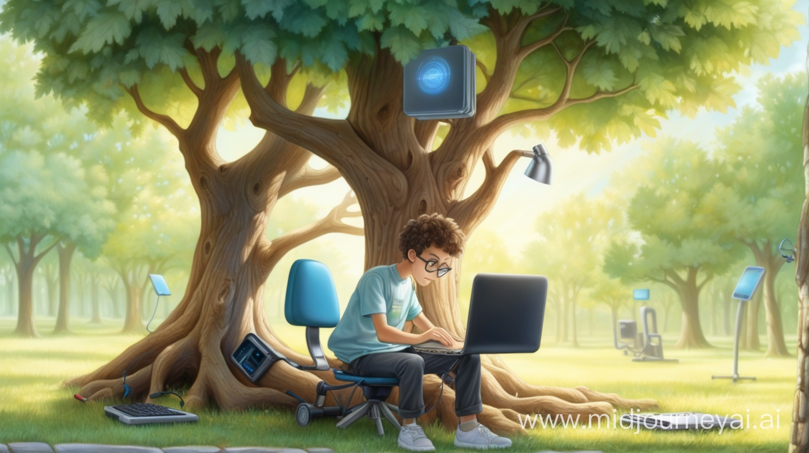

What do I care about? While I feel I always did care about stuff, and probably had pretty consistent values throughout my life, I have never taken the time to sit down and write up what drives me. Embarking on this new journey of building a blog and portfolio site for the new me---physicist out, data scientist in---it seems a worthy enough topic to get started. My hope is that it can help me focus now and help me bring the attention of my future self back to what matters to me. The way I approached this is to look for some core ideas and then I found some suitable names that happened to all start with E. So the three E's that capture my values... here we go.

### Equity

No, not in the sense of a part of a business to become rich (although I don't mind becoming rich, just to be able to do some more sensible thins). I mean equity in the sense of *something that is fair and just*. A better word nowadays is perhaps *justice*, as in *climate justice*, which is basically changing the system for sustainable and long term equity. So equity is the goal. Becoming aware of this one probably took the longest, but I feel the strongest about, hence it is on top of this list.

We live in an unjust world. People get born with very different opportunities on every scale. I wasn't unlucky: I was born in the Netherlands, I am a white, cis male, my parents went to university and though we weren't rich we were also never poor. I never really liked injustice (duh) I think my understanding of how many of the systemic sources of inequality are a result of the relatively recent history of colonialism, racism, and capitalism and are kept in place---knowingly or by convenient ignorance---by continuation of many power dynamics that either exploit that people are more easily divided by identity than by prosperity and so, in a world where the acretion of capital equals power

We also don't treat eachother on equal footing. Status is a thing. Even a feeling of self worth is often constructed based on criteria from the outside: Having money, being good at your job, being attractive and what have you. 

I was never stoked about this---I remember feeling pretty strongly about bullying at school---but the systemic part of it took a long time for me to truly appreciate. Perhaps one of the earliest observations after my first time in the USA was how the preuniversity grades of my school were so much whiter than the ones that prepare for "professional education"

...

### Ecology

Ecology as a value may seem odd, yet many of the perils on this planet seem to come from forgetting the fact how things are connected with other things. As a term it captures a diversity of ideas that I support: diversity, regenerative and circular economy, 

t allows to express the necessity to work on a systems level on creating an environment in which humans, animals and other organisms can thrive, with a diversity of niches, which is genuinly healthy and nurturing. Let me explain.

### Evidence

### Conclusion
There you have it, the list of three core values I landed on which I want to guide me in my professional life. It means I am looking to do work that structurally decreases 
